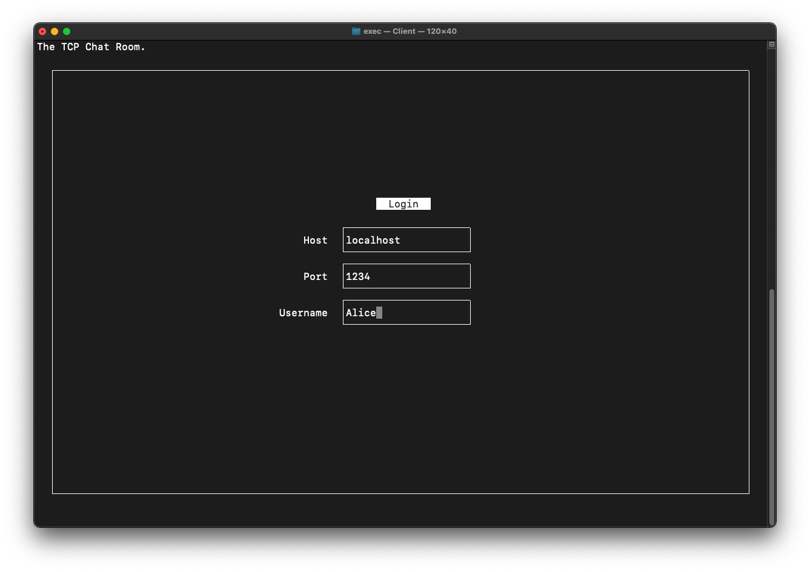
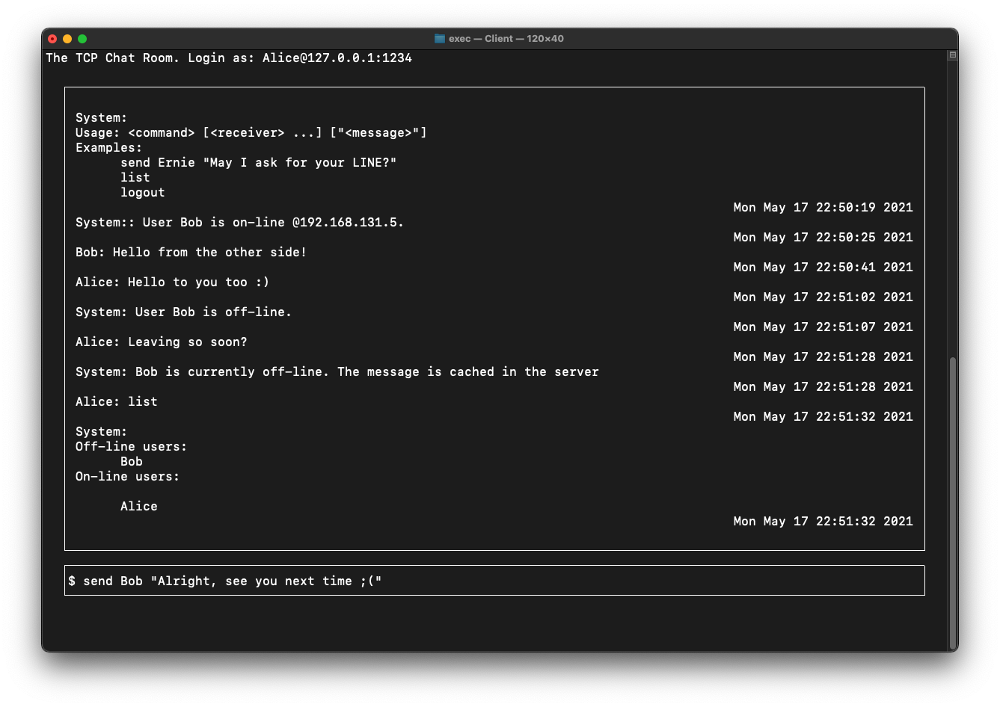

# On-line Chatting Service

[Demo](https://youtu.be/S-j5kQz_-7Y) (in Chinese).

The chat messages can now be encrypted by **Attribute-based encryption**. Check out the [`abe`](https://github.com/ernestchu/on-line-chatting-service/tree/abe) branch for more details.




## Dependencies

- ncurses
- CMake

## Build
Use CMake to build both the client and server program

```sh
mkdir build && cd build
cmake ..
make
```
Go to `exec` directory then you'll see the Client and Server program

## Usage
### Client Usage

- Use `./Client` to start the program

#### GUI Usage

- Login with
    1. The server's IP address or domain name (e.g. 127.0.0.1 or localhost).
    1. The port on which the server is listening.
    1. Your user name (`System` and `illegal` are reserved)
- Chat command (examples)
    - Usage: Type anything to show the usage.
    - Send: `send user1 user2 "message"`, the double quotes are mandatory since you can send the message to multiple users.
    - List: `list`, list the on-line and off-line users
    - Logout: `logout`, exit the program.

### Server Usage

- `./Server [-htv] <port number | service name>`
- Options:
    - `-h`: Show help.
    - `-t`: Run the server in multi-threaded mode, otherwise, using select().
    - `-v`: Produce verbose output.

